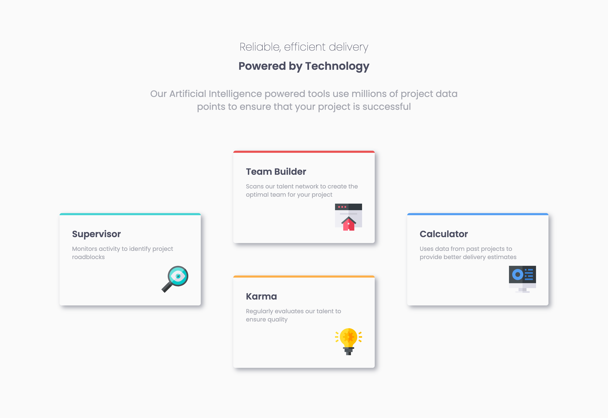

# Frontend Mentor - Four card feature section solution

This is a solution to the [Four card feature section challenge on Frontend Mentor](https://www.frontendmentor.io/challenges/four-card-feature-section-weK1eFYK). Frontend Mentor challenges help you improve your coding skills by building realistic projects. 

## Table of contents

- [Overview](#overview)
  - [The challenge](#the-challenge)
  - [Screenshot](#screenshot)
  - [Links](#links)
- [My process](#my-process)
  - [Built with](#built-with)
  - [What I learned](#what-i-learned)
  - [Continued development](#continued-development)
  - [Useful resources](#useful-resources)
- [Author](#author)


## Overview

### The challenge

Users should be able to:

- View the optimal layout for the site depending on their device's screen size

### Screenshot



### Links

- Solution URL: [Add solution URL here](https://github.com/lij110397/four-card-feature)
- Live Site URL: [Add live site URL here](https://lij110397.github.io/four-card-feature/)

## My process

### Built with

- Semantic HTML5 markup
- CSS custom properties
- Flexbox
- CSS Grid

### What I learned
**1. How to use flex box and grid to build responsive layout**
- Use flex box. Be familar with attributes like "flex-wrap","align-items","justify-content" and so on.
```css
form {
  display: flex;
  align-items: flex-end;
  flex-wrap: wrap;
  gap: 16px;
}
.name {
  flex-grow: 1;
  flex-basis: 160px;
}
.email {
  flex-grow: 3;
  flex-basis: 200px;
}
button {
  flex-grow: 1;
  flex-basis: 80px;
}
```
- Use fluid type and space
This makes the font size changing accordingly. It is based on a useful tool - utopia. But in this case, I only use "--step-0".
```css
:root {
    --step--2: clamp(0.6rem, 0.5032rem + 0.4128vi, 0.8748rem);
    --step--1: clamp(0.75rem, 0.629rem + 0.5161vi, 1.0935rem);
    --step-0: clamp(0.9375rem, 0.7863rem + 0.6451vi, 1.3669rem);
    --step-1: clamp(1.1719rem, 0.9829rem + 0.8063vi, 1.7086rem);
    --step-2: clamp(1.4648rem, 1.2286rem + 1.0079vi, 2.1357rem);
    --step-3: clamp(1.8311rem, 1.5358rem + 1.2599vi, 2.6697rem);
    --step-4: clamp(2.2888rem, 1.9197rem + 1.5749vi, 3.3371rem);
    --step-5: clamp(2.861rem, 2.3996rem + 1.9686vi, 4.1714rem);
  }
```
- Use relative unit like rem
- Use media quires when necessary.


### Continued development

**How can I develop the desktop design without using media quires, but using flex box or grid only?**

### Useful resources

- [Resource 1](https://www.joshwcomeau.com/css/interactive-guide-to-flexbox/) - This helped me for deeply understanding different attributes of flexbox and how to use them to make the layout more responsive.
- [Resource 2](https://www.youtube.com/watch?v=5uhIiI9Ld5M&ab_channel=Hey!Presents) - This is a youtube video recommended in the path. It is hard to understand, but it refers to how to use fluid types and space, which is helpful for me.
- [Resource 3](https://utopia.fyi/type/calculator?c=375,18,1.2,1240,20,1.25,5,2,&s=0.75|0.5|0.25,1.5|2|3|4|6,s-l&g=s,l,xl,12) - This is a website used to calculate fluid type and space.


## Author

- Website - Jiao Li

